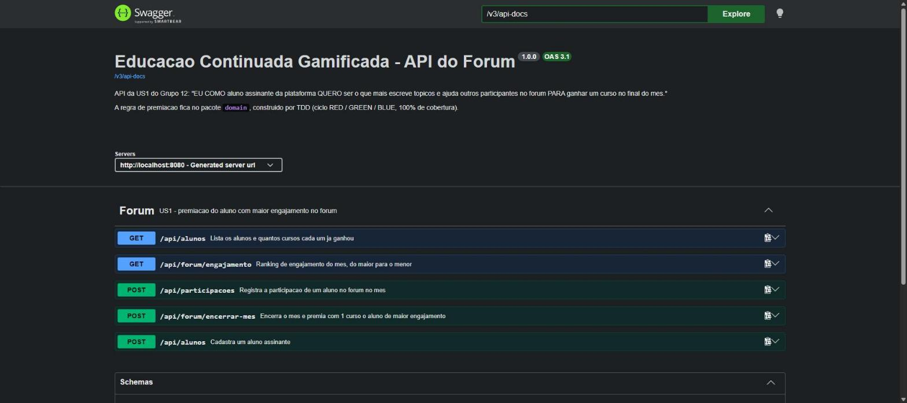
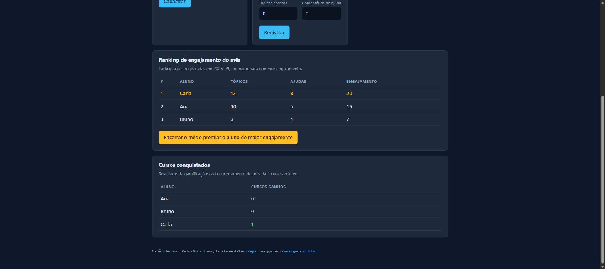
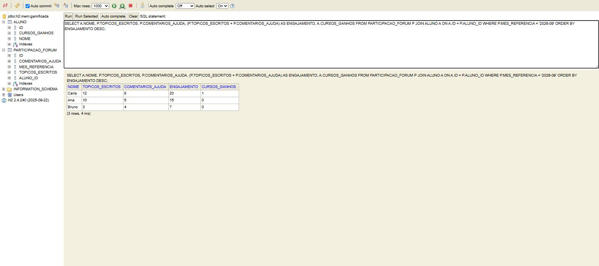
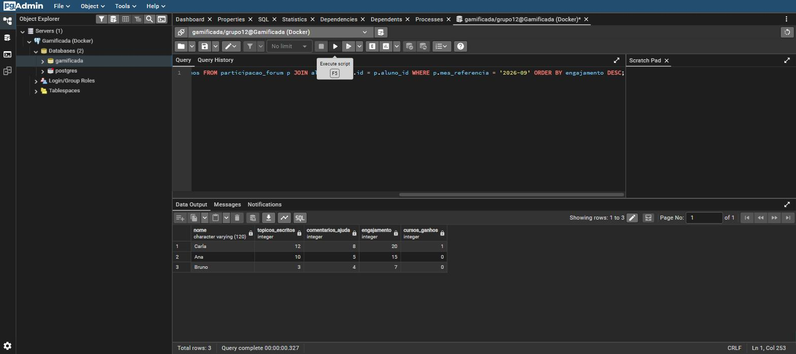

# Grupo 12 — Prática ATDD

Trabalho da disciplina de Engenharia de Software: **ATDD** (Acceptance Test Driven Development)
aplicado ao estudo de caso **Educação Continuada Gamificada**, com Spring Boot, ciclo TDD completo
(RED → GREEN → BLUE), BDD executável com Cucumber, front-end em VueJS e execução via Docker.

| | |
|---|---|
| **Testes** | 46 passando |
| **Cobertura** | **100%** de instruções, linhas e branches (travado no build por `jacoco:check`) |
| **Cenários BDD** | 8 cenários / 29 passos, todos passando |
| **Evidências** | [`docs/evidencias/`](docs/evidencias/README.md) |

---

## Integrantes

| Integrante | US que redigiu | Cenários BDD que escreveu |
|---|---|---|
| **Cauã Tolentino** | US1 | Cenário 1 e Cenário 4 |
| **Pedro Pizzi** | US2 | Cenário 2 |
| **Henry Tanaka** | US3 | Cenário 3 |

---

## Descrição do estudo de caso

> **Visão do produto:** Para quem busca se qualificar continuamente, a plataforma de Educação
> Continuada Gamificada oferece cursos online e EAD por assinatura, recompensando o aproveitamento
> e o engajamento no fórum com novos cursos, plano Premium, vouchers e moedas.

A plataforma é uma assinatura de cursos online/EAD. Para segurar o aluno na plataforma, ela é
gamificada: quem se destaca ganha recompensas. Existem três eixos de recompensa — **engajamento no
fórum** (escrever tópicos e ajudar colegas), **aproveitamento** (média nos cursos concluídos) e
**fidelidade** (quantidade de cursos acumulados). Cada eixo virou uma user story do grupo.

---

## User Stories

Uma US por integrante, com a identificação de quem redigiu.

### US1 — Premiação por engajamento no fórum · *autor: **Cauã Tolentino***

```gherkin
EU COMO aluno assinante da plataforma
QUERO ser o que mais escreve tópicos e ajuda outros participantes no fórum
PARA ganhar um curso no final do mês.
```

### US2 — Premiação por aproveitamento · *autor: **Pedro Pizzi***

```gherkin
EU COMO aluno assinante da plataforma
QUERO concluir um curso com média acima de 7,0
PARA ganhar o direito de realizar mais 3 cursos.
```

### US3 — Evolução para plano Premium · *autor: **Henry Tanaka***

```gherkin
EU COMO aluno assinante da plataforma
QUERO acumular 12 cursos conquistados
PARA ter meu plano atualizado para Premium com voucher e 3 moedas.
```

---

## Qual US foi a escolha

**A US1 — Premiação por engajamento no fórum**, redigida por **Cauã Tolentino**.

Por quê:

- é a US com a regra de negócio mais rica para o ciclo TDD — tem cálculo (engajamento), comparação
  entre vários alunos (quem é o maior) e um caso de exceção claro (mês sem nenhuma participação);
- gera um resultado observável e fácil de verificar: ao encerrar o mês, **exatamente um** aluno sai
  com `cursosGanhos` incrementado;
- as outras duas US dependem dela para fazer sentido no fluxo de gamificação — a US3, por exemplo,
  conta cursos acumulados, e é a US1 que produz esses cursos.

---

## BDD — cenários escritos por cada integrante

Os quatro cenários da planilha, com a identificação do autor e o teste automatizado correspondente.
Todos estão implementados em Gherkin em
[`src/test/resources/features/premiacao_forum.feature`](src/test/resources/features/premiacao_forum.feature).

### Cenário 1 — *autor: **Cauã Tolentino***

```gherkin
DADO um fórum com a participação de vários alunos no mês
E com engajamentos diferentes
QUANDO o mês é encerrado
ENTÃO o aluno com maior engajamento deve ganhar 1 curso
```
→ `ForumTest.devePremiarAlunoComMaiorEngajamento`

### Cenário 2 — *autor: **Pedro Pizzi***

```gherkin
DADO alunos com diferentes quantidades de tópicos e comentários de ajuda
QUANDO o engajamento de um aluno é calculado
ENTÃO deve ser a soma dos tópicos com os comentários de ajuda
```
→ `ParticipacaoForumTest.engajamentoDeveSomarTopicosEComentarios`

### Cenário 3 — *autor: **Henry Tanaka***

```gherkin
DADO um fórum com vários alunos participando
QUANDO o mês é encerrado
ENTÃO somente o aluno de maior engajamento é premiado
```
→ `ForumTest.somenteAlunoDeMaiorEngajamentoEPremiado`

### Cenário 4 — *autor: **Cauã Tolentino***

```gherkin
DADO um fórum sem nenhuma participação no mês
QUANDO o mês é encerrado
ENTÃO nenhum aluno deve ser premiado
```
→ `ForumTest.naoDevePremiarNinguemQuandoNaoHouveParticipacao`

O Cucumber roda esses cenários contra o **mesmo pacote `domain` construído pelo TDD** — é isso que
fecha o ATDD: o critério de aceite executa contra a regra de negócio de verdade, não contra um mock.

> **Planilha:** a planilha usada na primeira entrega está versionada em
> [`Grupo12_ATDD.xlsx`](Grupo12_ATDD.xlsx).

---

## TDD — ciclo RED / GREEN / BLUE

Estrutura de pacotes pedida no enunciado:

```
src/main/java/com/example/grupo12_praticaatdd/domain/       <- pacote Domain
    Aluno.java  ParticipacaoForum.java  Forum.java

src/test/java/com/example/grupo12_praticaatdd/domaintest/   <- pacote DomainTest
    AlunoTest.java  ParticipacaoForumTest.java  ForumTest.java
```

### 🔴 RED — testes falhando

Os testes foram escritos **a partir dos BDD**, antes da implementação. As classes de domínio
existiam só com as assinaturas dos métodos.

```
Tests run: 16, Failures: 11, Errors: 2, Skipped: 0
BUILD FAILURE
```

📄 [`docs/evidencias/tdd/01-red-testes-falhando.txt`](docs/evidencias/tdd/01-red-testes-falhando.txt)

### 🟢 GREEN — testes passando, mas com amarelo e vermelho

Implementação mais simples que faz a suíte passar. **Nenhum teste foi alterado.**

```
Tests run: 16, Failures: 0, Errors: 0, Skipped: 0
BUILD SUCCESS
```

Mas a cobertura ainda não estava limpa:

| Classe | Instruções | Branches | Linhas | Status |
|---|---|---|---|---|
| `Forum` | 69/71 (97%) | 12/14 (86%) | 20/21 (95%) | 🔴 **VERMELHO** + 🟡 amarelo |
| `Aluno` | 38/38 (100%) | 4/4 (100%) | 12/12 (100%) | 🟢 |
| `ParticipacaoForum` | 48/48 (100%) | 6/6 (100%) | 15/15 (100%) | 🟢 |

O `Forum` tinha duas guardas defensivas impossíveis de cobrir (`participacoes == null` e
`vencedora != null`) e um `return null` inalcançável.

📄 [`docs/evidencias/tdd/02-green-testes-passando.txt`](docs/evidencias/tdd/02-green-testes-passando.txt) ·
[`02-green-cobertura.md`](docs/evidencias/tdd/02-green-cobertura.md)

### 🔵 BLUE — refatoração até 100%, sem vermelho e sem amarelo

O laço imperativo do `premiarAlunoDoMes()` virou uma expressão só com `Stream.max`, eliminando as
guardas redundantes e o código morto. As validações duplicadas de `Aluno` e `ParticipacaoForum`
foram unificadas. **De novo: nenhum teste foi alterado.**

| Classe | Instruções | Branches | Linhas | Status |
|---|---|---|---|---|
| `Aluno` | 30/30 (100%) | 4/4 (100%) | 9/9 (100%) | 🟢 **100%** |
| `ParticipacaoForum` | 43/43 (100%) | 6/6 (100%) | 13/13 (100%) | 🟢 **100%** |
| `Forum` | 48/48 (100%) | 2/2 (100%) | 16/16 (100%) | 🟢 **100%** |

**0 instruções perdidas, 0 branches perdidos, 0 linhas perdidas.**

📄 [`docs/evidencias/tdd/03-blue-testes-passando.txt`](docs/evidencias/tdd/03-blue-testes-passando.txt) ·
[`03-blue-cobertura.md`](docs/evidencias/tdd/03-blue-cobertura.md) ·
[relatório HTML](docs/evidencias/tdd/jacoco-blue/index.html)

### Estado final: 100% no projeto inteiro

Depois do ciclo TDD vieram os testes das demais camadas. A suíte final tem **46 testes** e o
projeto inteiro — domínio, entity, repository, service, DTO, controller e config — está em
**100% de instruções, linhas e branches**.

O `pom.xml` tem uma regra do JaCoCo que **quebra o build** se a cobertura regredir:

```xml
<rule>
    <element>BUNDLE</element>
    <limits>
        <limit><counter>INSTRUCTION</counter><value>COVEREDRATIO</value><minimum>1.00</minimum></limit>
        <limit><counter>LINE</counter><value>COVEREDRATIO</value><minimum>1.00</minimum></limit>
        <limit><counter>BRANCH</counter><value>COVEREDRATIO</value><minimum>1.00</minimum></limit>
    </limits>
</rule>
```

📄 [`docs/evidencias/tdd/04-suite-completa.txt`](docs/evidencias/tdd/04-suite-completa.txt) ·
[relatório HTML final](docs/evidencias/tdd/jacoco-final/index.html)

---

## Arquitetura

```
com.example.grupo12_praticaatdd
├── domain/         Aluno, ParticipacaoForum, Forum   <- regra de negócio, construída por TDD
├── entity/         AlunoEntity, ParticipacaoForumEntity   (JPA)
├── repository/     AlunoRepository, ParticipacaoForumRepository   (Spring Data JPA)
├── dto/            AlunoDTO, NovoAlunoDTO, NovaParticipacaoDTO, ParticipacaoDTO, PremiacaoDTO
├── service/        ForumService, RecursoNaoEncontradoException
├── controller/     ForumController, TratadorDeErros, ErroDTO
└── config/         OpenApiConfig
```

Decisão importante: **o domínio é separado das entidades JPA**. As classes do pacote `domain` não
conhecem Spring nem Hibernate — por isso continuam testáveis sem subir contexto e sem banco, que é
exatamente o que o TDD precisa. O `ForumService` carrega os dados do banco, monta um `Forum` do
domínio, chama `premiarAlunoDoMes()` e persiste o resultado.

---

## Endpoints

| Método | Rota | Descrição |
|---|---|---|
| `POST` | `/api/alunos` | Cadastra um aluno assinante |
| `GET` | `/api/alunos` | Lista os alunos e quantos cursos cada um já ganhou |
| `POST` | `/api/participacoes` | Registra a participação de um aluno no fórum no mês |
| `GET` | `/api/forum/engajamento?mes=AAAA-MM` | Ranking de engajamento do mês |
| `POST` | `/api/forum/encerrar-mes?mes=AAAA-MM` | **Aplica a US1**: premia com 1 curso o aluno de maior engajamento |

Erros seguem um corpo padrão (`ErroDTO`): `400` para violação de regra do domínio
(nome em branco, quantidade negativa, mês fora do formato `AAAA-MM`) e `404` para aluno inexistente.

### Swagger

- **Swagger UI:** http://localhost:8080/swagger-ui.html
- **OpenAPI JSON:** http://localhost:8080/v3/api-docs



---

## Front-end VueJS

SPA em **Vue 3 + Vite** ([`frontend/`](frontend/README.md)) com quatro blocos: cadastrar aluno,
registrar participação, ranking do mês (com o botão de encerrar o mês) e os cursos conquistados.



No screenshot acima, lendo dados reais do PostgreSQL: **Carla** lidera com engajamento 20
(12 tópicos + 8 ajudas) e é a única com 1 curso ganho — a US1 funcionando ponta a ponta.

---

## Bancos de dados

A aplicação roda nos dois bancos, trocando só o perfil.

### H2 (perfil padrão, e perfil `h2`)

```bash
./mvnw spring-boot:run
```

Console: http://localhost:8080/h2-console · JDBC URL `jdbc:h2:mem:gamificada` · usuário `sa` · senha vazia



### PostgreSQL (perfil `postgres`)

Usado quando a aplicação sobe via Docker Compose. Host, porta, base, usuário e senha vêm de
variáveis de ambiente (`application-postgres.properties`).



📄 [`docs/evidencias/banco/`](docs/evidencias/banco/)

---

## Rodando via Docker

```bash
docker compose up --build
```

Sobe quatro containers:

| Serviço | Container | URL | O que é |
|---|---|---|---|
| `postgres` | `grupo12-postgres` | `localhost:5432` | PostgreSQL 17 (volume persistente) |
| `pgadmin` | `grupo12-pgadmin` | http://localhost:5050 | PgAdmin, **já com a conexão registrada** |
| `backend` | `grupo12-backend` | http://localhost:8080 | API Spring Boot no perfil `postgres` |
| `frontend` | `grupo12-frontend` | http://localhost:5173 | Front VueJS servido por nginx |

Detalhes:

- o `backend` só inicia depois que o *healthcheck* do `postgres` passa;
- o `Dockerfile` é multi-stage — builda o jar com Maven e a imagem final leva só o JRE;
- o nginx do `frontend` faz proxy de `/api` para o backend, então o navegador conversa com uma
  origem só;
- o PgAdmin é provisionado por [`docker/pgadmin/servers.json`](docker/pgadmin/servers.json) e já
  abre conectado no banco `gamificada` — não precisa cadastrar servidor na mão.

📄 [`docs/evidencias/docker/01-docker-compose-rodando.txt`](docs/evidencias/docker/01-docker-compose-rodando.txt)

---

## Rodando localmente

```bash
# API com H2 (padrão)
./mvnw spring-boot:run

# API apontando para um PostgreSQL local
./mvnw spring-boot:run -Dspring-boot.run.profiles=postgres

# suíte completa + cobertura (falha se sair de 100%)
./mvnw clean verify

# front-end em modo dev (proxy /api -> localhost:8080)
cd frontend && npm install && npm run dev
```

Relatório de cobertura em `target/site/jacoco/index.html`.
Relatório do Cucumber em `target/cucumber-report.html`.

---

## Stack

| Camada | Tecnologia |
|---|---|
| Linguagem | Java 17 (build em JDK 21) |
| Framework | Spring Boot 4.1.1 — Spring Web (MVC), Spring Data JPA |
| Bancos | H2 (memória) e PostgreSQL 17 |
| Documentação | springdoc-openapi 3 (Swagger UI) |
| Testes | JUnit 5, Mockito, AssertJ |
| BDD | Cucumber 7 (Gherkin em português) |
| Cobertura | JaCoCo 0.8.13 |
| Front-end | Vue 3 + Vite, servido por nginx |
| Infra | Docker, Docker Compose, PgAdmin |
| IDE | IntelliJ IDEA Ultimate |

---

## Evidências

Índice completo em **[`docs/evidencias/README.md`](docs/evidencias/README.md)**:
ciclo TDD, relatório do Cucumber, chamadas de API, os dois bancos rodando, Docker e capturas de tela.
