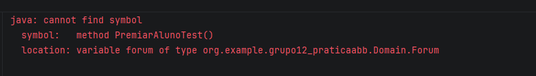
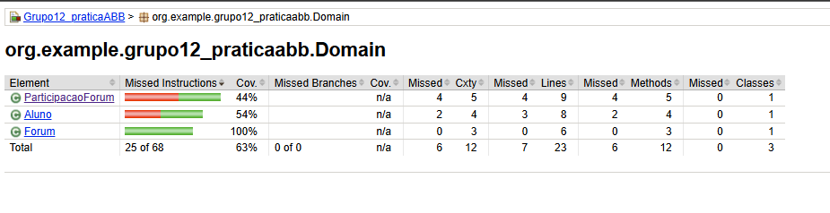
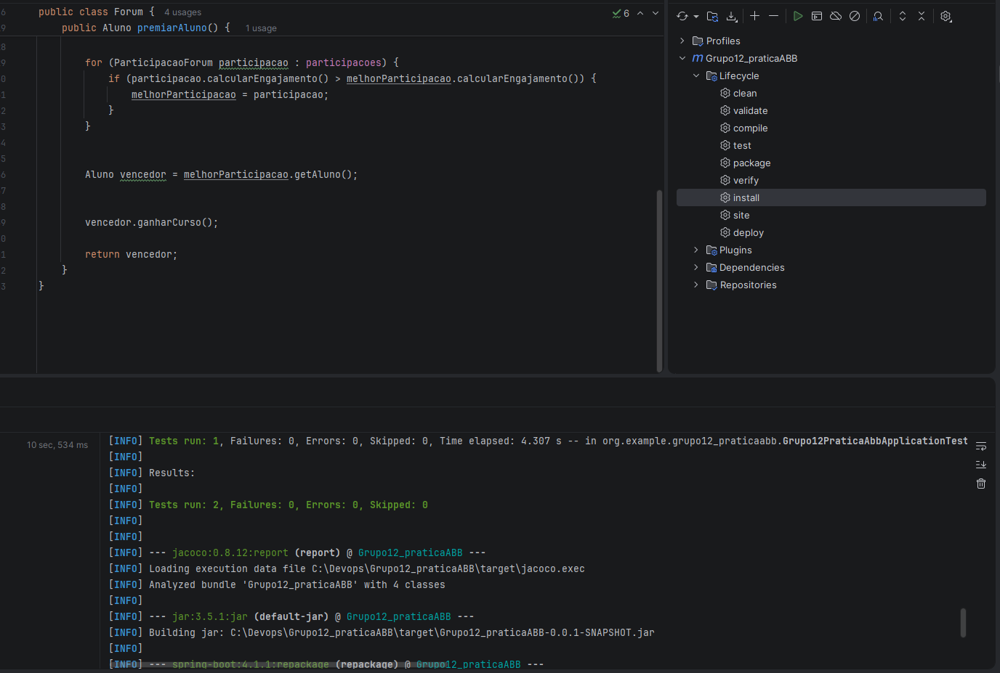

## Evidências TDD

### 🔴 RED

O teste foi criado antes da implementação da regra de negócio.
Neste momento o teste falha porque o método
` PremiarAlunoTest()` ainda não foi implementado.

### 🟢 GREEN

Nesta fase, escrevemos o código mínimo necessário para fazer o teste compilar e passar. Corrigimos a chamada no arquivo de teste para o método correto de domínio e implementamos o método `premiarAluno()` na classe `Forum` retornando o aluno "Ana" de forma direta (hardcoded).

O teste executou com sucesso (ficou verde) e o relatório do JaCoCo abaixo comprova que a classe `Forum` foi testada, atingindo 100% de cobertura de instruções nesta etapa inicial.

### 🔵 BLUE

Na fase final do ciclo TDD, o retorno fixo (hardcode) foi removido e substituído pela implementação real da regra de negócio. O método `premiarAluno()` agora itera dinamicamente sobre a lista de participações do fórum, compara o engajamento calculado de cada aluno e identifica a melhor participação. Além disso, a regra que concede 1 curso ao vencedor (`vencedor.ganharCurso()`) foi integrada, atendendo aos critérios de aceite definidos no BDD.

A evidência abaixo comprova que, mesmo após a substituição total da estrutura interna do método pela lógica final, os testes foram reexecutados e continuaram passando com sucesso (verde), garantindo a integridade e o funcionamento correto da funcionalidade.

